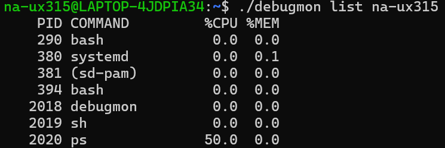
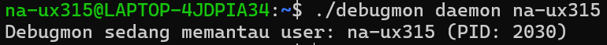
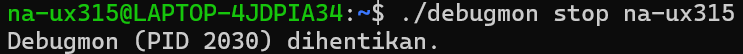
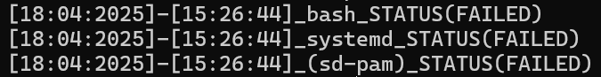
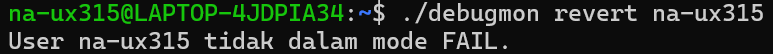

# Sisop-2-2025-IT34
Member :
1. Christiano Ronaldo Silalahi (5027241025)
2. Naila Cahyarani Idelia (5027241063)
3. Daniswara Fausta Novanto (5027241050)


# Soal Modul 2

pertama-tama download dulu file starterkitnya


setelah di download, file starterkit langsung di unzip

lalu buatlah code dengan

```bash
nano starterkit.c
```

berikut adalah fungsi codenya :

### 1. **Deklarasi Variabel dan Fungsi Utama**
Di awal kode, kita mendeklarasikan beberapa variabel penting:
- `char *pidfile = "decrypt.pid";`  
  Menyimpan nama file PID yang digunakan untuk melacak proses dekripsi.
  
- Fungsi `main()` akan menangani parsing argumen dari command line menggunakan `getopt_long()`.

### 2. **Fungsi `decrypt()`**
Fungsi ini bertanggung jawab untuk:
- Membuat direktori quarantine dan menjalankan daemon
- Menggunakan fungsi `base64_decode()` untuk mendekripsi nama file yang terenkripsi dengan Base64.
- Mengubah nama file yang telah didekripsi dan memindahkannya ke direktori `starter_kit` yang sama.


### 3. **Fungsi `move_to_quarantine()`**
Fungsi ini bertugas untuk:
- Memindahkan file dari direktori `starter_kit` ke `quarantine`.
- juga mengenkripsi isi dari starter_kit.


### 4. **Fungsi `return_from_quarantine()`**
Fungsi ini digunakan untuk mengembalikan file yang telah dipindahkan ke `quarantine` ke direktori `starter_kit`.
- Program memeriksa apakah file ada di direktori `quarantine`, lalu memindahkannya kembali ke `starter_kit` dengan `rename()`.


### 5. **Fungsi `eradicate_files()`**
Fungsi ini digunakan untuk menghapus file yang ada di direktori `quarantine`.
- Program akan memeriksa apakah file ada di direktori `quarantine` dan menghapusnya menggunakan `remove()`.


### 6. **Fungsi `shutdown_decryption()`**
Fungsi ini bertugas untuk mematikan proses daemon dekripsi dengan membaca PID dari file `decrypt.pid` dan menghentikan proses yang terkait menggunakan `kill()`.

### 7. **Fungsi `log_activity()`**
Fungsi ini bertanggung jawab untuk mencatat semua aktivitas program dalam file log `activity.log`. Setiap kali ada operasi yang dilakukan (seperti dekripsi, pemindahan file, penghapusan, dan shutdown), fungsi ini akan mencatatnya dengan timestamp dan jenis aksi yang dilakukan.


### 8. **Menangani Argumen Command Line**
Program ini menggunakan `getopt_long()` untuk menangani berbagai opsi yang diberikan pengguna:
- `--decrypt`: Memulai proses dekripsi file.
- `--quarantine`: Memindahkan file yang telah didekripsi ke direktori `quarantine`.
- `--return`: Mengembalikan file dari `quarantine` ke `starter_kit`.
- `--eradicate`: Menghapus file di direktori `quarantine`.
- `--shutdown`: Menghentikan proses daemon yang sedang berjalan.

</div>

## Soal 4

Buat sebuah *file* debugmon.c

```bash
$ nano debugmon.c
```
Coba program dan compile terlebih dahulu dengan `gcc debugmon.c -o debugmon`

### a.

Fungsi do_list:

```bash
void do_list(const char *user) {
    char cmd[128];
    snprintf(cmd, sizeof(cmd), "ps -u %s -o pid,comm,%%cpu,%%mem", user);

    FILE *fp = popen(cmd, "r");
    if (fp == NULL) {
        perror("Gagal menjalankan ps");
        return;
    }

    char line[256];
    while (fgets(line, sizeof(line), fp)) {
        printf("%s", line);
    }

    pclose(fp);
}
```

Fungsi ini digunakan untuk menampilkan daftar proses yang dimiliki oleh user.

Kemudian execute program dengan cara `./debugmon list <user>`.



### b. 

Fungsi do_daemon:

```bash
void do_daemon(const char *user) {
    char failfile[64];
    snprintf(failfile, sizeof(failfile), "fail.%s", user);
    if (access(failfile, F_OK) == 0) {
        printf("User %s sedang dalam mode FAIL. Tidak bisa menjalankan daemon.\n", user);
        return;
    }

    pid_t pid = fork();
    if (pid < 0) {
        perror("Fork gagal");
        return;
    }

    if (pid > 0) {
        FILE *pf = fopen("debugmon.pid", "w");
        if (pf) {
            fprintf(pf, "%d", pid);
            fclose(pf);
        }
        printf("Debugmon sedang memantau user: %s (PID: %d)\n", user, pid);
        return;
    }

    // Child daemon
    while (1) {
        char cmd[128];
        snprintf(cmd, sizeof(cmd), "ps -u %s -o comm=", user);
        FILE *fp = popen(cmd, "r");
        if (fp) {
            char line[128];
            while (fgets(line, sizeof(line), fp)) {
                line[strcspn(line, "\n")] = 0;
                log_status(line, "RUNNING");
            }
            pclose(fp);
        }
        sleep(5);
    }
}
```

Fungsi ini mengubah program menjadi daemon yang memantau proses user secara berkala dan mencatat statusnya dalam berkas log.

Kemudian execute program dengan cara `./debugmon daemon <user>`.


.png)

### c. 

Fungsi do_stop:

```bash
void do_stop() {
    FILE *pf = fopen("debugmon.pid", "r");
    if (!pf) {
        printf("Tidak ditemukan PID file. Debugmon mungkin tidak aktif.\n");
        return;
    }

    int pid;
    fscanf(pf, "%d", &pid);
    fclose(pf);

    if (kill(pid, SIGTERM) == 0) {
        printf("Debugmon (PID %d) dihentikan.\n", pid);
        remove("debugmon.pid");
        log_status("stop", "SUCCESS");
    } else {
        perror("Gagal menghentikan daemon");
    }
}
```

Fungsi ini digunakan untuk menghentikan daemon debugmon yang sedang berjalan.

Kemudian execute program dengan cara `./debugmon stop <user>`.


.png)


### d. 

Fungsi do_fail:

```bash
void do_fail(const char *user) {
    printf("Mematikan semua proses milik user: %s...\n", user);

    char cmd[128];
    snprintf(cmd, sizeof(cmd), "ps -u %s -o pid=,comm=", user);
    FILE *fp = popen(cmd, "r");
    if (fp) {
        char line[256];
        while (fgets(line, sizeof(line), fp)) {
            int pid;
            char proc[128];

            if (sscanf(line, "%d %[^\n]", &pid, proc) != 2) {
                continue;
            }

            printf("Coba bunuh: %s (PID: %d)\n", proc, pid);

            if (kill(pid, SIGKILL) == 0) {
                printf("Berhasil bunuh: %s (PID: %d)\n", proc, pid);
                log_status(proc, "FAILED");
            } else {
                perror("Gagal membunuh proses");
            }
        }
        pclose(fp);
    } else {
        perror("Gagal membuka output ps");
    }

    char failfile[64];
    snprintf(failfile, sizeof(failfile), "fail.%s", user);
    FILE *fail = fopen(failfile, "w");
    if (fail) fclose(fail);

    printf("User %s sekarang dalam mode FAIL.\n", user);
}
```

Fungsi ini dapat digunakan untuk menghentikan semua proses user secara paksa dan mengaktifkan mode "FAIL" untuk user tersebut.

Kemudian execute program dengan cara `./debugmon fail <user>`.



### e.

Fungsi do_revert:

```bash
void do_revert(const char *user) {
    char failfile[64];
    snprintf(failfile, sizeof(failfile), "fail.%s", user);
    if (remove(failfile) == 0) {
        printf("User %s telah keluar dari mode FAIL.\n", user);
        log_status("revert", "SUCCESS");
    } else {
        printf("User %s tidak dalam mode FAIL.\n", user);
    }
}
```

Dengan menggunakan fungsi ini, berkas indikator "fail" user dihapus. Fungsi ini mengeluarkan user dari mode "FAIL" dan memungkinkan daemon debugmon untuk dipantau kembali.

Kemudian execute program dengan cara `./debugmon revert <user>`.


.png)

### f.

Fungsi log_status:

```bash
#include <stdio.h>      
#include <stdlib.h>     
#include <string.h>     
#include <unistd.h>     
#include <sys/types.h>  
#include <signal.h>     
#include <time.h>

void log_status(const char *proc, const char *status) {
    FILE *log = fopen("debugmon.log", "a");
    if (!log) return;

    time_t t = time(NULL);
    struct tm *tm_info = localtime(&t);

    char date[20], timebuf[20];
    strftime(date, sizeof(date), "%d:%m:%Y", tm_info);
    strftime(timebuf, sizeof(timebuf), "%H:%M:%S", tm_info);

    fprintf(log, "[%s]-[%s]_%s_STATUS(%s)\n", date, timebuf, proc, status);
    fclose(log);
}      
```

Fungsi ini mencatat status proses ke dalam berkas log bernama `debugmon.log`. Tanggal, waktu, nama proses, dan status akan disertakan dalam setiap catatan log.

Fungsi main:

```bash
int main(int argc, char *argv[]) {
    if (argc < 2) {
        printf("Gunakan perintah: list|daemon|stop|fail|revert <user>\n");
        return 1;
    }

    const char *cmd = argv[1];
    const char *user = argc > 2 ? argv[2] : NULL;

    if (strcmp(cmd, "list") == 0 && user) do_list(user);
    else if (strcmp(cmd, "daemon") == 0 && user) do_daemon(user);
    else if (strcmp(cmd, "stop") == 0) do_stop();
    else if (strcmp(cmd, "fail") == 0 && user) do_fail(user);
    else if (strcmp(cmd, "revert") == 0 && user) do_revert(user);
    else printf("Perintah tidak dikenali atau user tidak disebutkan.\n");

    return 0;
}
```
